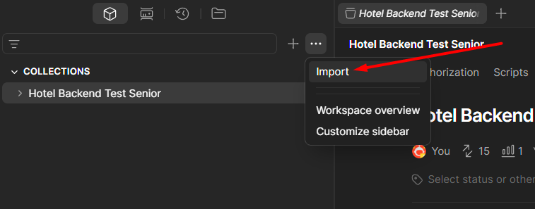

API REST desenvolvida com Spring Boot para gerenciamento de hóspedes e reservas.

## Tecnologias que utilizei

- Java 17
- Spring Boot
- PostgreSQL
- Docker
- Maven

## Requisitos para rodar

- Docker
- Java 17
- Maven

---

## Subir banco de dados

Executar:

```bash
docker compose up -d
```

Banco PostgreSQL:

| Campo    | Valor     |
|----------|-----------|
| Host     | localhost |
| Porta    | 5432      |
| Database | hotel     |
| Usuário  | postgres  |
| Senha    | postgres  |

---

## Rodar aplicação

Instalar dependências:

```bash
mvn clean install
```

Subir aplicação localmente:

```bash
mvn spring-boot:run
```

Aplicação disponível em:

```text
http://localhost:8080
```

---

## Collection Postman

Importe no postman a collection para realizar as requisições:
https://we.tl/t-TFRWVNPAmWBTy6BO


